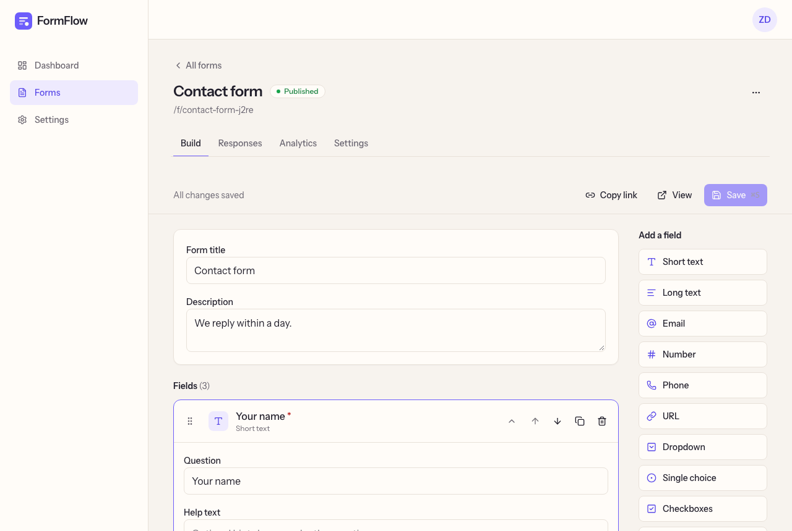

# FormFlow

Create forms. Collect responses. Understand your data.



## Overview

FormFlow is a simple form builder for freelancers, creators and small teams. Build a form, share its link and follow the responses from one dashboard.

## Features

- Form builder with 11 field types and drag and drop that also works with the keyboard
- Draft, published, paused and archived states
- Public form links such as `/f/contact-form`
- Response list with search, date filter and detail view
- CSV export
- Views, starts, submissions and completion rate
- Register, login, email verification and password reset

## Tech Stack

- **Frontend:** Next.js (App Router), React, Tailwind CSS, shadcn/ui, React Hook Form, Zod
- **Backend:** Node.js, Express, MongoDB
- **Testing:** Vitest, Supertest, Playwright

## Architecture

```text
Browser → Next.js → /api → Express → MongoDB
```

- Next.js forwards `/api` requests to Express, so the session is kept in an `HttpOnly` cookie.
- Pages are Server Components by default. Client components are used only where interaction is needed.
- Marketing pages are static and public forms are cached. Private pages are never cached.
- Every request is authorized on the API, and users can only access their own forms.

More details are in [docs/architecture.md](docs/architecture.md).

## Project Structure

```text
formflow/
├── backend/     Express API
├── frontend/    Next.js app
└── docs/        Architecture notes
```

## Getting Started

Requires Node.js 22.12 or newer.

```bash
git clone https://github.com/zeynepbass/formflow.git
cd formflow
npm install
cp .env.example backend/.env
cp .env.example frontend/.env.local
```

Set `AUTH_SECRET` and `REVALIDATE_SECRET`, then run each command in its own terminal:

```bash
npm run db
npm run dev:api
npm run dev:web
```

`npm run db` starts a local MongoDB. Skip it if you already have one.

Open http://localhost:3000.

## Environment Variables

| Variable              | Description                           |
| --------------------- | ------------------------------------- |
| `NEXT_PUBLIC_APP_URL` | Web app URL                           |
| `API_INTERNAL_URL`    | API URL used by Next.js               |
| `REVALIDATE_SECRET`   | Shared secret between the API and web |
| `PORT`                | API port                              |
| `NODE_ENV`            | `development` or `production`         |
| `MONGODB_URI`         | MongoDB connection string             |
| `AUTH_SECRET`         | Secret for session tokens (32+ chars) |
| `CORS_ORIGIN`         | Allowed web origin                    |
| `APP_URL`             | Web app URL used in emails            |
| `UPLOAD_DIR`          | Folder for uploaded files             |
| `TRUST_PROXY`         | Number of trusted proxies             |

## Testing

```bash
npm run lint
npm test
npm run build
npm run test:e2e -w frontend
```

## License

[MIT](LICENSE)
