# FormFlow

Form oluştur. Yanıtları topla. Verini anla.

FormFlow; serbest çalışanlar, içerik üreticileri ve küçük ekipler için sade bir form oluşturucu. Form hazırlanır, bağlantısı paylaşılır ve yanıtlar tek bir panelden takip edilir.

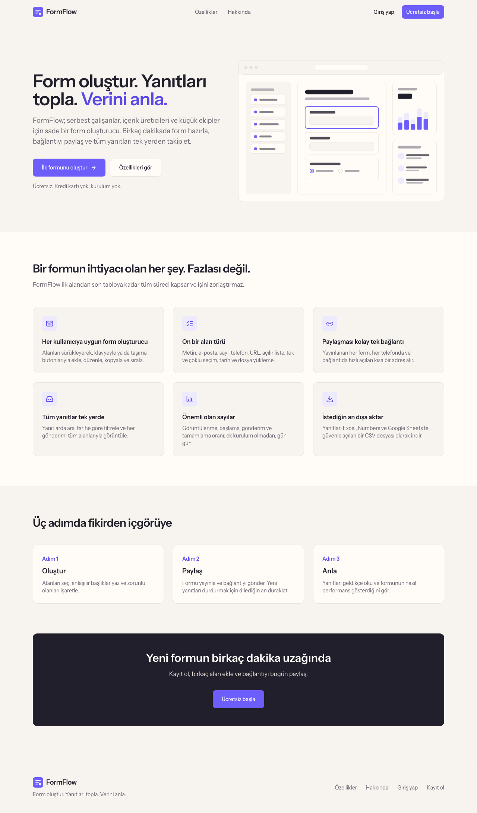

## Özellikler

- 11 alan türüyle form oluşturma
- Sürükle-bırak ve klavyeyle alan sıralama
- Taslak, yayında, duraklatıldı ve arşivlendi durumları
- Paylaşılabilir form bağlantısı
- Arama ve tarih filtresiyle yanıt listesi
- CSV dışa aktarma
- Görüntülenme, gönderim ve tamamlama oranı

## Ekran Görüntüleri

### Tanıtım sayfaları

| Özellikler                              | Hakkında                           |
| --------------------------------------- | ---------------------------------- |
| 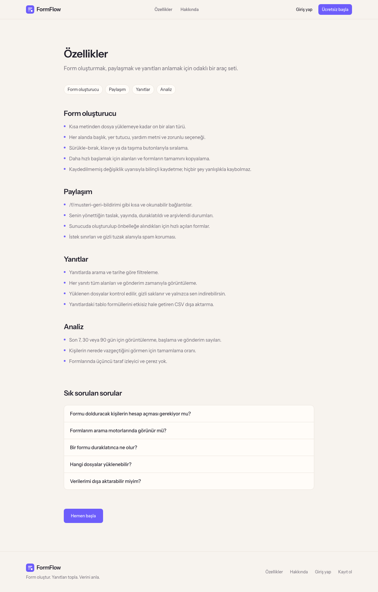 | 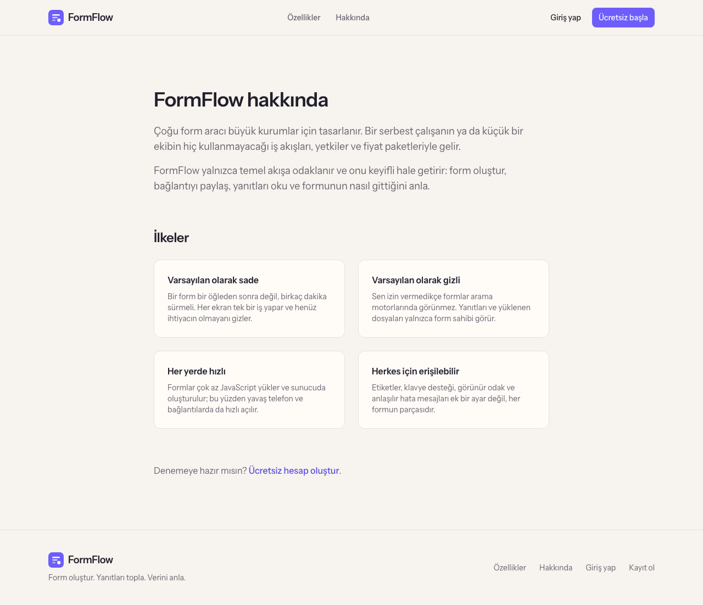 |

### Hesap

| Giriş                           | Kayıt                              | Şifremi unuttum                                     |
| ------------------------------- | ---------------------------------- | --------------------------------------------------- |
| 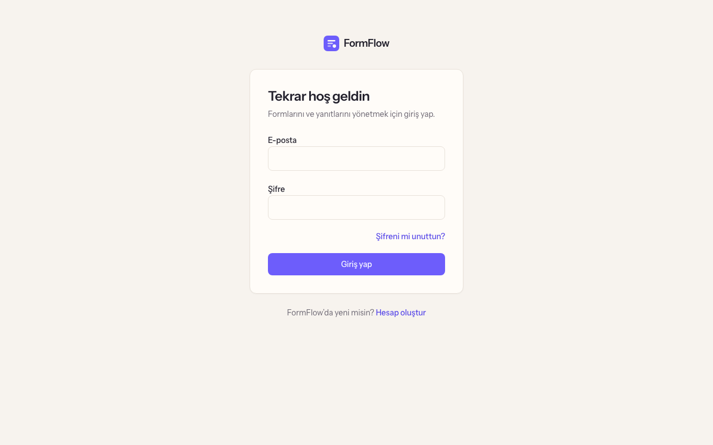 | 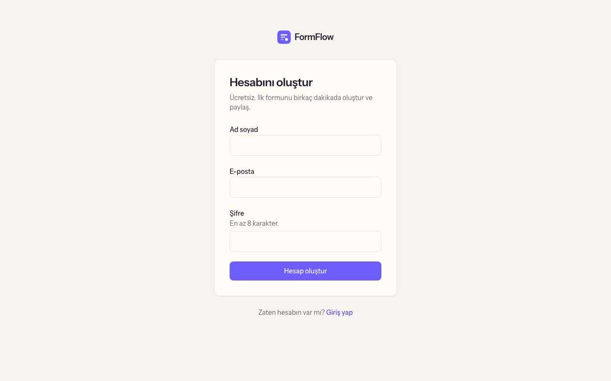 | 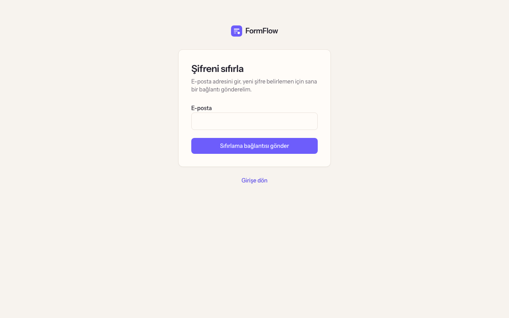 |

### Panel ve formlar

| Panel                               | Formlar                           |
| ----------------------------------- | --------------------------------- |
| 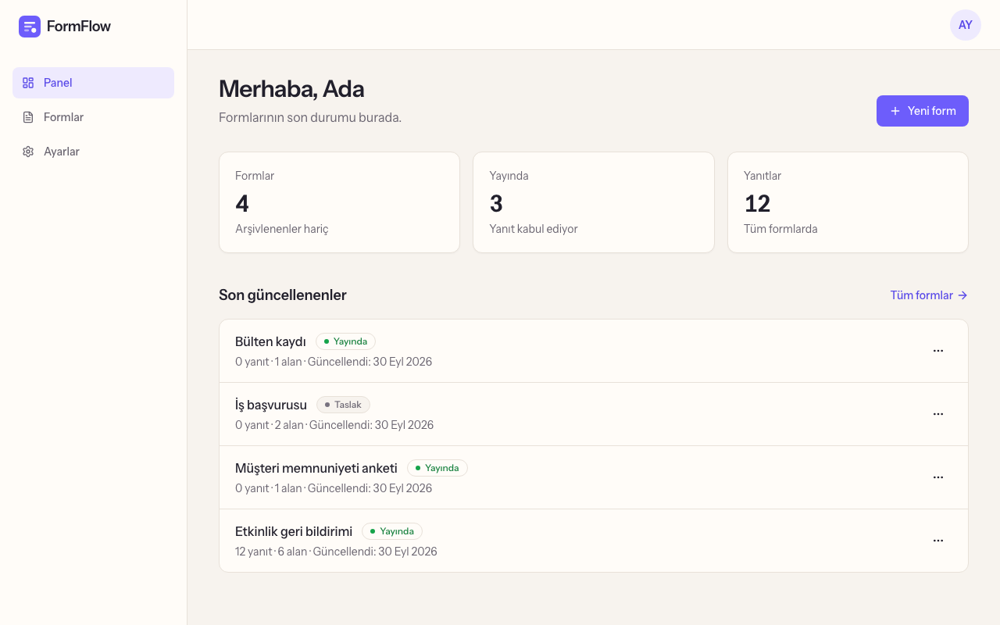 | 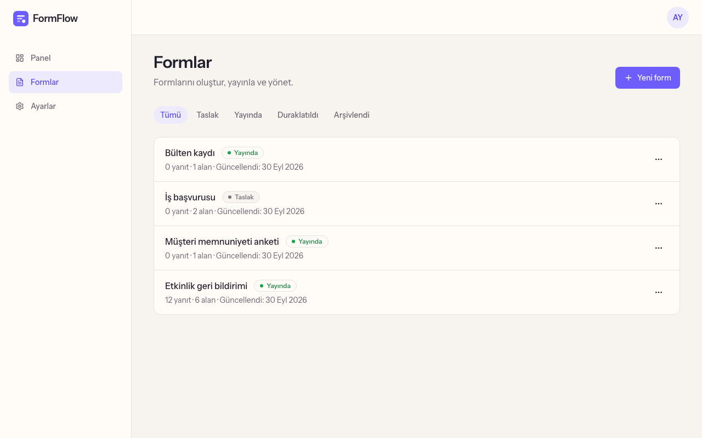 |

| Yeni form                              | Hesap ayarları                                      |
| -------------------------------------- | --------------------------------------------------- |
| 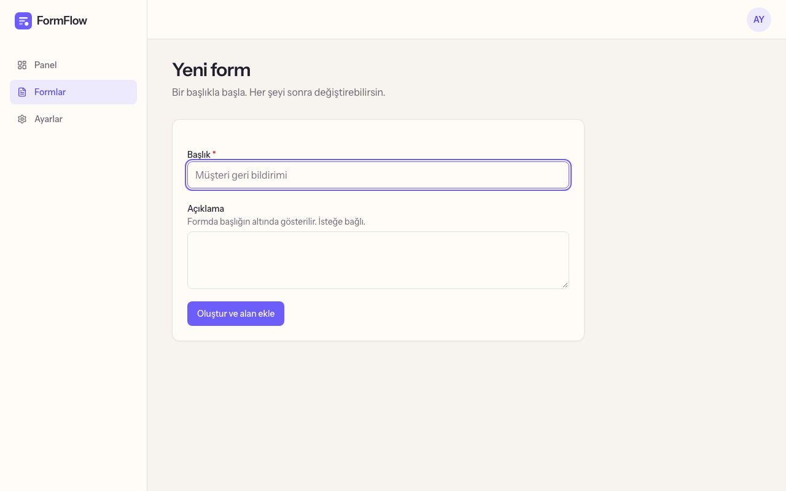 | 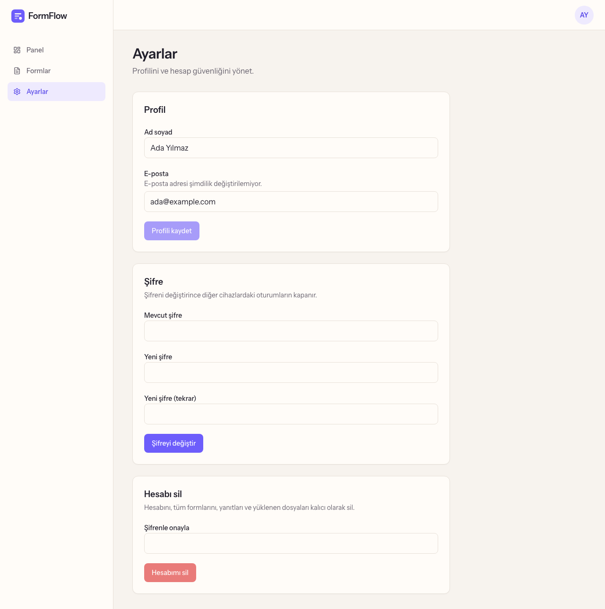 |

### Form oluşturucu


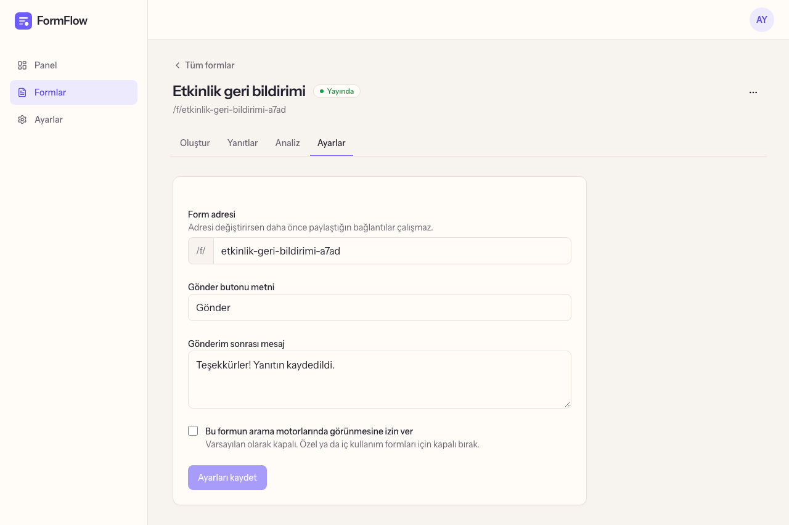

### Yanıtlar ve analiz

| Yanıt listesi                               | Yanıt detayı                                     |
| ------------------------------------------- | ------------------------------------------------ |
|  | 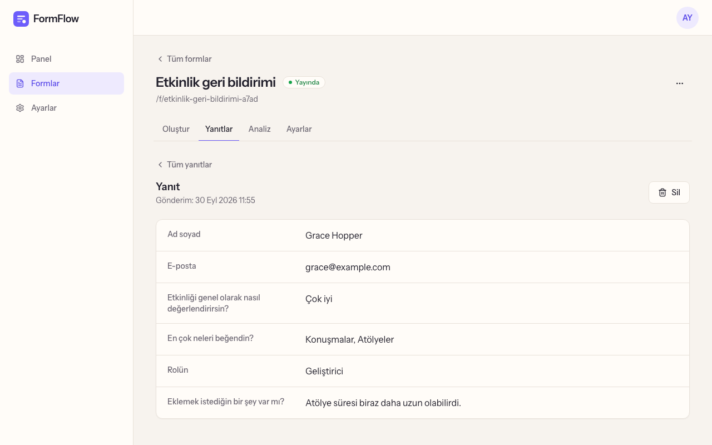 |


### Yayınlanan form


### Mobil

| Yayınlanan form                       | Panel                                            |
| ------------------------------------- | ------------------------------------------------ |
|  | 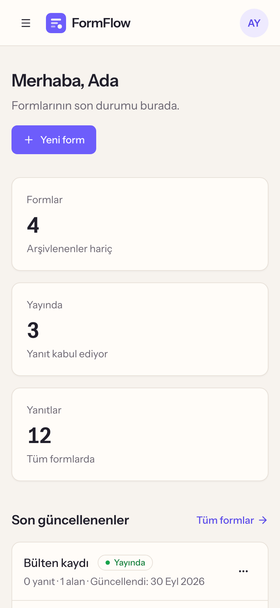 |

## Teknolojiler

- **Frontend:** Next.js, React, Tailwind CSS, shadcn/ui, React Hook Form, Zod
- **Backend:** Node.js, Express, MongoDB
- **Test:** Vitest, Supertest, Playwright

Mimari notları için: [docs/architecture.md](docs/architecture.md)

## Kurulum

Node.js 22.12 veya üzeri gerekir.

```bash
git clone https://github.com/zeynepbass/formflow.git
cd formflow
npm install
cp .env.example backend/.env
cp .env.example frontend/.env.local
```

`AUTH_SECRET` ve `REVALIDATE_SECRET` değerlerini doldur, ardından her komutu ayrı bir terminalde çalıştır:

```bash
npm run db
npm run dev:api
npm run dev:web
```

Uygulama http://localhost:3000 adresinde açılır.

## Testler

```bash
npm run lint
npm test
npm run test:e2e -w frontend
```

## Lisans


[MIT](LICENSE)
